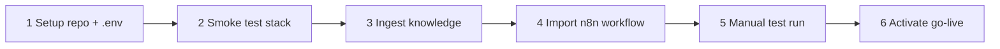

# Operator guide — AI inbox automation

End-to-end guide for running the RAG email/WhatsApp assistant: provision the stack, ingest a client's knowledge base, import an n8n workflow, smoke-test it, and go live. Each step links to a focused runbook with full detail.

## What this project is

A small RAG pipeline that turns a client's FAQs / docs into auto-replies on email and WhatsApp:

```
Customer message
    -> IMAP/WhatsApp trigger (n8n)
    -> Ollama embedding
    -> Qdrant vector search (one collection per client)
    -> llama-server chat completion
    -> SMTP/WhatsApp reply (or polite fallback)
```

The repo ships:

- **CLI ingestion** ([scripts/ingest.py](../scripts/ingest.py)) and **one-shot RAG** ([scripts/reply_once.py](../scripts/reply_once.py)).
- **Streamlit KB admin** ([apps/kb_admin/app.py](../apps/kb_admin/app.py)) for non-CLI ingest, search, and collection management.
- **Three n8n workflows** under [workflows/](../workflows/): email-only, WhatsApp-only, combined.
- **Smoke-test script** ([scripts/verify_stack.py](../scripts/verify_stack.py)) and a one-shot RAG demo ([scripts/verify_demo_rag.sh](../scripts/verify_demo_rag.sh)).

n8n itself is **not** installed by this repo — you run it separately and import the workflow JSON.

## Prerequisites

- An **AI host** running Ollama (embeddings), Qdrant (vectors), and a llama-server (OpenAI-compatible chat).
- Network reachability between this repo's host, the AI host, and n8n.
- Python 3.10+ and `pip` on the machine that will run ingest / KB admin.
- An n8n instance (Cloud or self-hosted).

If the AI stack is not up yet, stand it up first — services, ports, and example endpoints are documented in [connectivity.md](connectivity.md).

## Workflow overview



## 1. Setup

Clone the repo on the machine that will host ingest and the KB admin (often the AI host itself), create the Python env, and configure `.env`.

- Full server bootstrap: [deploy-ai-server.md](deploy-ai-server.md)
- Environment template: [.env.example](../.env.example)

```bash
git clone https://github.com/Spottie97/ai-automation-n8n-workflow.git
cd ai-automation-n8n-workflow
chmod +x scripts/bootstrap_server.sh
./scripts/bootstrap_server.sh
$EDITOR .env             # fill in OLLAMA_HOST, QDRANT_URL, LLAMA_SERVER_URL, ...
chmod 600 .env
```

Keep `.env.example` portable (localhost / placeholder URLs). Real hostnames or IPs belong in your local `.env` only — do not commit them.

## 2. Smoke-test the stack

```bash
source .venv/bin/activate
python scripts/verify_stack.py
```

This checks Ollama embeddings, Qdrant REST, and llama-server chat using the same env vars n8n will use. If it fails, fix URLs in `.env` first — see [connectivity.md](connectivity.md) for endpoint shapes and curl checks.

## 3. Ingest a client's knowledge

One Qdrant collection per client. The CLI and the Streamlit GUI use the same pipeline; pick whichever fits the workflow.

**CLI** (good for scripts / first-run):

```bash
python scripts/ingest.py ingest --client-id demo_client --input sample_data/demo_faq.txt
```

**Streamlit KB admin** (good for operators / repeat updates):

```bash
streamlit run apps/kb_admin/app.py
```

- Technical setup, security, systemd: [kb-admin.md](kb-admin.md)
- Operator walkthrough (tabs, JSON shapes, common pitfalls): [kb-admin-user-guide.md](kb-admin-user-guide.md)
- Exposing the GUI over HTTPS without inbound ports: [cloudflare-tunnel-kb-admin.md](cloudflare-tunnel-kb-admin.md)

## 4. Import the n8n workflow

Pick the workflow that matches the channels you need:

| Goal | Workflow JSON |
|------|---------------|
| Email only | [workflows/rag-email-mvp.json](../workflows/rag-email-mvp.json) |
| WhatsApp only | [workflows/rag-whatsapp-mvp.json](../workflows/rag-whatsapp-mvp.json) |
| Email + WhatsApp | [workflows/rag-email-whatsapp-mvp.json](../workflows/rag-email-whatsapp-mvp.json) |

In n8n: **Workflows → Import from File** → pick the JSON, then reassign IMAP / SMTP / WhatsApp credentials (credential IDs are not embedded in exports).

Set the same env vars n8n will read (`OLLAMA_HOST`, `OLLAMA_EMBED_MODEL`, `QDRANT_URL`, `LLAMA_SERVER_URL`, `LLAMA_CHAT_MODEL`, `CLIENT_ID`, `SMTP_FROM`, `WHATSAPP_PHONE_NUMBER_ID`) — n8n must be able to reach those URLs from its own host/container, which is not always `127.0.0.1`.

- High-level node pipeline: [n8n-email-mvp-outline.md](n8n-email-mvp-outline.md)
- Per-node HTTP payloads, Qdrant body shapes, and n8n expressions: [n8n-email-mvp-build.md](n8n-email-mvp-build.md)

## 5. Manual test run

Before activating any trigger, run a manual execution against the demo data to confirm the chain works end-to-end:

- Step-by-step manual test: [n8n-runbook-import-test.md](n8n-runbook-import-test.md)

Expected RAG path: Parse → Ollama → Merge → Qdrant → Build RAG Context (`has_rag: true`) → LLM → channel send. Fallback path runs when the collection is empty or the question is off-topic.

## 6. Activate and go live

Phased rollout (email first, then WhatsApp, then combined) keeps moving parts small:

- Go-live checklist: [n8n-go-live-checklist.md](n8n-go-live-checklist.md)

Per-client onboarding (collection naming, prompt, escalation, 48h monitoring) is captured in [../sales/demo-pack.md](../sales/demo-pack.md) and [../ai_automation_side_hustle_checklist.md](../ai_automation_side_hustle_checklist.md).

## When something is wrong

- Stack reachability (Ollama 404, Qdrant collection missing, llama-server model id): [connectivity.md](connectivity.md) and [n8n-troubleshooting.md](n8n-troubleshooting.md).
- n8n-specific issues (Code-node `$env`, WhatsApp single-webhook rule, IMAP/SMTP re-assignment after import, prompt edit locations): [n8n-troubleshooting.md](n8n-troubleshooting.md).
- KB admin issues (password gate, collection name mismatch with n8n `CLIENT_ID`): [kb-admin.md](kb-admin.md) and [kb-admin-user-guide.md](kb-admin-user-guide.md).

## Runbook index

| Topic | File |
|-------|------|
| Server bootstrap on the AI host | [deploy-ai-server.md](deploy-ai-server.md) |
| Stack smoke checks (Ollama / Qdrant / llama-server) | [connectivity.md](connectivity.md) |
| KB admin install + deploy | [kb-admin.md](kb-admin.md) |
| KB admin operator walkthrough | [kb-admin-user-guide.md](kb-admin-user-guide.md) |
| KB admin over Cloudflare Tunnel (HTTPS + Basic Auth) | [cloudflare-tunnel-kb-admin.md](cloudflare-tunnel-kb-admin.md) |
| n8n node pipeline overview | [n8n-email-mvp-outline.md](n8n-email-mvp-outline.md) |
| n8n implementation detail (HTTP payloads, env, expressions) | [n8n-email-mvp-build.md](n8n-email-mvp-build.md) |
| n8n import + manual test runbook | [n8n-runbook-import-test.md](n8n-runbook-import-test.md) |
| n8n go-live checklist (phased) | [n8n-go-live-checklist.md](n8n-go-live-checklist.md) |
| n8n troubleshooting | [n8n-troubleshooting.md](n8n-troubleshooting.md) |
| Demo and sales pack | [../sales/demo-pack.md](../sales/demo-pack.md) |
| Master project checklist | [../ai_automation_side_hustle_checklist.md](../ai_automation_side_hustle_checklist.md) |
