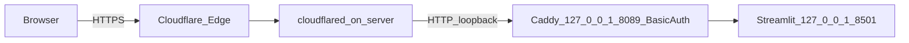

# KB admin behind Cloudflare Tunnel (HTTPS + Basic Auth)

Goal: **no open inbound ports** on the ai-server. **TLS** terminates at Cloudflare. **cloudflared** dials out. A **loopback-only Caddy** instance adds **HTTP Basic Auth** (username + password — you can use your email as the username), then proxies to **Streamlit on `127.0.0.1:8501`**.

This runbook matches `**kb.reinhardterasmus.info**` → tunnel → `**http://127.0.0.1:8089**` (Caddy listening on loopback) → Streamlit.

We are **not** using Cloudflare Access here; auth is **only** Basic Auth at Caddy plus optional `**KB_ADMIN_PASSWORD`** inside Streamlit.

## Architecture




## Prerequisites

- DNS zone **reinhardterasmus.info** on Cloudflare.
- Repo on `ai-server` with working `.env` (`verify_stack.py` passes).
- Streamlit KB admin bound to `**127.0.0.1:8501`** only — [deploy/systemd/kb-admin.service.example](../deploy/systemd/kb-admin.service.example).
- Set `**KB_ADMIN_PASSWORD**` in `.env` for an in-app gate after Basic Auth (recommended).

## 0. Start order on the server

1. `**kb-admin.service**` — Streamlit on `127.0.0.1:8501`
2. **Caddy** — `http://:8089` with `bind 127.0.0.1` (plain HTTP on loopback) with Basic Auth → proxy to `8501` — [deploy/caddy/Caddyfile.example](../deploy/caddy/Caddyfile.example)
3. `**cloudflared`** — ingress hostname → `http://127.0.0.1:8089` — [deploy/cloudflared/config.yml.example](../deploy/cloudflared/config.yml.example)

## 1. Install cloudflared (Ubuntu server)

Use Cloudflare’s **APT** repo (works on Ubuntu LTS and current Debian-derived releases). Full options: [Install cloudflared](https://developers.cloudflare.com/cloudflare-one/networks/connectors/cloudflare-tunnel/downloads/).

```bash
# 1) Cloudflare package signing key
sudo mkdir -p --mode=0755 /usr/share/keyrings
curl -fsSL https://pkg.cloudflare.com/cloudflare-main.gpg | sudo tee /usr/share/keyrings/cloudflare-main.gpg >/dev/null

# 2) APT source for cloudflared (needs distro codename, e.g. jammy, noble)
echo "deb [signed-by=/usr/share/keyrings/cloudflare-main.gpg] https://pkg.cloudflare.com/cloudflared $(. /etc/os-release && echo "$VERSION_CODENAME") main" \
  | sudo tee /etc/apt/sources.list.d/cloudflared.list

# 3) Install
sudo apt-get update
sudo apt-get install -y cloudflared

# 4) Confirm
cloudflared --version
```

If `**VERSION_CODENAME**` is empty on a minimal image, install `lsb-release` and use `$(lsb_release -cs)` instead, or set the codename manually (e.g. `noble` for Ubuntu 24.04, `jammy` for 22.04):

```bash
sudo apt-get install -y lsb-release
echo "deb [signed-by=/usr/share/keyrings/cloudflare-main.gpg] https://pkg.cloudflare.com/cloudflared $(lsb_release -cs) main" \
  | sudo tee /etc/apt/sources.list.d/cloudflared.list
sudo apt-get update && sudo apt-get install -y cloudflared
```

**Alternative (no APT):** download a `.deb` for your architecture from the [downloads page](https://developers.cloudflare.com/cloudflare-one/networks/connectors/cloudflare-tunnel/downloads/) and run `sudo apt install ./cloudflared_*_amd64.deb` (adjust filename).

## 2. Authenticate and create a tunnel

```bash
cloudflared tunnel login
cloudflared tunnel create kb-admin
```

Save the **tunnel UUID** and **credentials JSON** path (often `~/.cloudflared/<UUID>.json`).

## 3. Public hostname (DNS)

```bash
cloudflared tunnel route dns kb-admin kb.reinhardterasmus.info
```

## 4. Install Caddy and Basic Auth

1. Install Caddy: [Install Caddy](https://caddyserver.com/docs/install).
2. Generate a bcrypt hash for your password:
   ```bash
   caddy hash-password
   ```
3. Copy [deploy/caddy/Caddyfile.example](../deploy/caddy/Caddyfile.example) to the server (e.g. `/etc/caddy/kb-admin.Caddyfile`) and merge or `import` into `/etc/caddy/Caddyfile`. Replace `your_username` with a short username **or** your email (if login fails with an email, use a short username).
4. Replace the `$2a$14$...` placeholder with the hash from step 2.

**Critical:** use **`http://:8089`** with **`bind 127.0.0.1`**. The `http://` prefix prevents automatic HTTPS/local CA behavior. The `:8089` address accepts Cloudflare's original `Host: kb.reinhardterasmus.info`, while `bind 127.0.0.1` keeps the listener loopback-only.

Do **not** use `http://127.0.0.1:8089` as the Caddy site address for this tunnel. That address only matches requests with `Host: 127.0.0.1`; Cloudflare sends `Host: kb.reinhardterasmus.info`, which can produce a blank browser page with `HTTP 200` and `content-length: 0`.

5. Validate and reload:
   ```bash
   sudo caddy validate --config /etc/caddy/Caddyfile
   sudo systemctl reload caddy
   ```
   Warnings like **“Unnecessary header_up X-Forwarded-Host / X-Forwarded-For”** are safe to ignore after you remove those lines—Caddy sets them. **`X-Forwarded-Proto https`** is still required. Optional: `sudo caddy fmt --overwrite /etc/caddy/Caddyfile` clears the “not formatted” warning.

**Do not** bind this site to `0.0.0.0`; keep loopback only. Optional dedicated unit: [deploy/systemd/caddy-kb-proxy.service.example](../deploy/systemd/caddy-kb-proxy.service.example).

### Blank page in Safari/Firefox but `curl` returns 200

If `curl -u "$USER:$PASS" -D- -o /tmp/kb.html https://kb.reinhardterasmus.info/` shows **`HTTP 200`** but **`content-length: 0`**, Caddy is likely not matching the Cloudflare `Host` header. Use `http://:8089` plus `bind 127.0.0.1`, then reload Caddy.

If the HTML body is non-empty but the browser is still blank, check the Streamlit WebSocket next. **Streamlit** needs `wss://`; set **`X-Forwarded-Proto: https`** on the `reverse_proxy` to Streamlit ([deploy/caddy/Caddyfile.example](../deploy/caddy/Caddyfile.example)). Caddy already forwards **`X-Forwarded-Host`** / **`X-Forwarded-For`**—duplicating them triggers validate warnings and is unnecessary. Reload Caddy, hard-refresh the browser.

In Safari: **Develop → Show JavaScript Console** (enable Develop menu first) and look for WebSocket / mixed-content errors.

### After fix — logs should look quiet

Reload and check: you want **no** `tls.obtain` / `automatic TLS certificate management` lines for `127.0.0.1` on port 8089, and **no** `sudo` / `pki.ca.local` errors.

```bash
sudo journalctl -u caddy -n 30 --no-pager
```

## 5. Tunnel config

Copy [deploy/cloudflared/config.yml.example](../deploy/cloudflared/config.yml.example) to `~/.cloudflared/config.yml` (or `/etc/cloudflared/config.yml`), set `tunnel`, `credentials-file`, and confirm:

- `**hostname`:** `kb.reinhardterasmus.info`
- `**service`:** `http://127.0.0.1:8089` (Caddy — **not** Streamlit directly)

Test manually:

```bash
cloudflared tunnel run kb-admin
```

## 6. Run cloudflared as a service

Follow: [Run as a service · cloudflared](https://developers.cloudflare.com/cloudflare-one/networks/connectors/cloudflare-tunnel/do-more-with-tunnels/local-management/as-a-service/).

```bash
sudo cloudflared service install
sudo systemctl enable --now cloudflared
```

Ensure the service reads your `config.yml` path per Cloudflare docs.

## 7. Verification

- On server: `ss -tlnp | grep -E '8501|8089'` — expect `**127.0.0.1:8501**` (Streamlit) and `**127.0.0.1:8089**` (Caddy), not `0.0.0.0` for public exposure.
- From the internet: open `**https://kb.reinhardterasmus.info**` — browser should prompt for **Basic Auth**, then Streamlit (and optionally `KB_ADMIN_PASSWORD` if set).

## 8. Optional: Cloudflare Access later

If you outgrow Basic Auth (team SSO, audit logs), you can add **Cloudflare Access** on the same hostname; then you may remove Caddy Basic Auth or keep defense-in-depth. Not required for the current plan.

## 9. n8n / Qdrant

This tunnel is **only** for the KB admin UI. **Do not** expose Qdrant REST to the public internet. n8n keeps using URLs reachable **from n8n** (often host LAN IP or Docker gateway), not necessarily this hostname.

## References

- [Cloudflare Tunnel](https://developers.cloudflare.com/cloudflare-one/networks/connectors/cloudflare-tunnel/)
- [Caddy basic_auth](https://caddyserver.com/docs/caddyfile/directives/basic_auth)
- [kb-admin.md](kb-admin.md)

