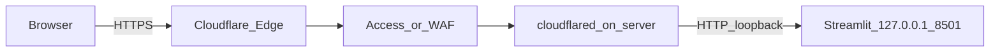

# KB admin behind Cloudflare Tunnel (HTTPS + Access or Basic Auth)

Goal: **no open inbound ports** on the ai-server. Only **localhost** serves Streamlit; **cloudflared** dials out to Cloudflare; users hit **HTTPS** on your zone. Lock the app with **Cloudflare Access** (recommended) or **Basic Auth** in a tiny local reverse proxy.

## Architecture



## Prerequisites

- A **Cloudflare zone** (your domain DNS on Cloudflare).
- **Streamlit KB admin** running on the server **only** on `127.0.0.1:8501` (see [deploy/systemd/kb-admin.service.example](../deploy/systemd/kb-admin.service.example)).
- Set **`KB_ADMIN_PASSWORD`** in `.env` as an extra layer (not sufficient alone on the public internet).

## 1. Install cloudflared (on ai-server)

Follow the current official install steps: [Connect networks · Install cloudflared](https://developers.cloudflare.com/cloudflare-one/networks/connectors/cloudflare-tunnel/downloads/).

Example (Debian/Ubuntu — verify against docs; package name may change):

```bash
# Example only — prefer the official download page for your OS/arch
sudo mkdir -p --mode=0755 /usr/share/keyrings
curl -fsSL https://pkg.cloudflare.com/cloudflare-main.gpg | sudo tee /usr/share/keyrings/cloudflare-main.gpg >/dev/null
# ... then add apt repo per Cloudflare docs, install cloudflared
```

## 2. Authenticate and create a tunnel

On the server (browser or token flow per docs):

```bash
cloudflared tunnel login
cloudflared tunnel create kb-admin
```

Note the **tunnel UUID** and the **credentials JSON** path (often `~/.cloudflared/<UUID>.json`).

## 3. Public hostname (DNS)

Create a DNS record for the tunnel (replace zone/subdomain):

```bash
cloudflared tunnel route dns kb-admin kb-admin.example.com
```

Use a **non-obvious hostname**; avoid names like `qdrant` or `admin` in the URL if you care about discovery.

## 4. Tunnel config

Create `~/.cloudflared/config.yml` (or `/etc/cloudflared/config.yml` for a system install). See stub: [deploy/cloudflared/config.yml.example](../deploy/cloudflared/config.yml.example).

Minimal shape:

```yaml
tunnel: YOUR_TUNNEL_UUID
credentials-file: /home/reinhardt/.cloudflared/YOUR_TUNNEL_UUID.json

ingress:
  - hostname: kb-admin.example.com
    service: http://127.0.0.1:8501
  - service: http_status:404
```

If you add **Basic Auth** locally (next section), point `service` at that proxy port instead (e.g. `http://127.0.0.1:8089`).

Test:

```bash
cloudflared tunnel run kb-admin
```

## 5. Lock with Cloudflare Access (recommended)

In **Cloudflare Zero Trust** dashboard:

1. **Access** → **Applications** → **Add an application**.
2. Choose **Self-hosted**; **Application domain** = `kb-admin.example.com` (same as tunnel hostname).
3. Add an **Access policy** (e.g. allow emails ending in `@yourcompany.com`, or OTP to specific addresses).

Traffic is **TLS-terminated at Cloudflare**; Access runs **before** the tunnel forwards to your origin. No Basic Auth needed on the box if Access is enough.

## 6. Alternative: Basic Auth on localhost

If you prefer not to use Access, put a small proxy **only on loopback** in front of Streamlit.

**Example (Caddy)** — listen on loopback only; use `caddy hash-password` for a bcrypt hash, then see [Caddy basicauth](https://caddyserver.com/docs/caddyfile/directives/basicauth) for your Caddy version:

```caddy
127.0.0.1:8089 {
  basicauth /* {
    youruser $2a$14$...
  }
  reverse_proxy 127.0.0.1:8501
}
```

Then set tunnel ingress `service: http://127.0.0.1:8089`.

**Example (nginx)** — `auth_basic` + `proxy_pass` to `http://127.0.0.1:8501`, listen `127.0.0.1:8089`.

Do **not** bind this proxy to `0.0.0.0` unless you fully understand the risk; tunnel → loopback is the point.

## 7. Run cloudflared as a service

Follow: [Run as a service · cloudflared](https://developers.cloudflare.com/cloudflare-one/networks/connectors/cloudflare-tunnel/do-more-with-tunnels/local-management/as-a-service/).

Typical pattern after install:

```bash
sudo cloudflared service install
sudo systemctl enable --now cloudflared
```

Ensure the service reads your **config path** (set in the unit or default location per docs).

## 8. Verification

- From the internet (or phone off Wi‑Fi): open `https://kb-admin.example.com` — expect Access login or Basic Auth, then Streamlit.
- On server: `ss -tlnp | grep 8501` — Streamlit should be **127.0.0.1:8501**, not `0.0.0.0`, unless you intentionally LAN-bind (not required with tunnel).

## 9. n8n / Qdrant

This runbook is **only** for the KB admin UI. **Do not** expose Qdrant’s REST port raw to the internet without **API keys**, strict policies, and the same tunnel/VPN discipline. n8n should continue using URLs reachable **from n8n**, not necessarily this Streamlit hostname.

## References

- [Cloudflare Tunnel](https://developers.cloudflare.com/cloudflare-one/networks/connectors/cloudflare-tunnel/)
- [Cloudflare Access](https://developers.cloudflare.com/cloudflare-one/policies/access/)
- [kb-admin.md](kb-admin.md) — Streamlit hardening notes
